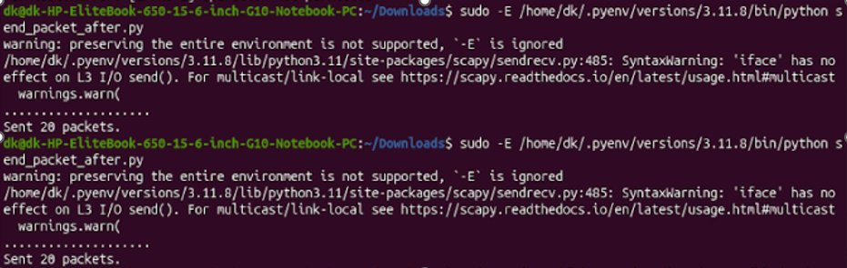
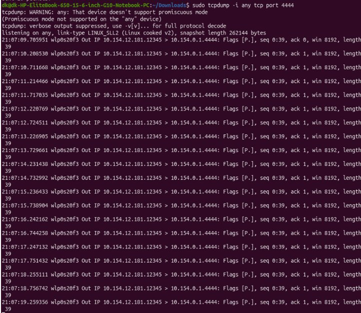
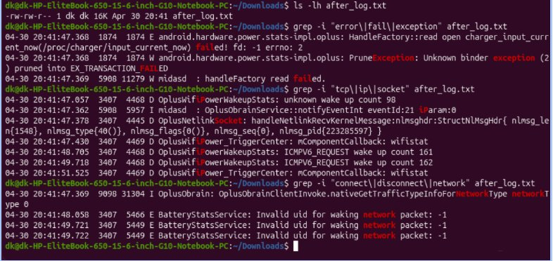
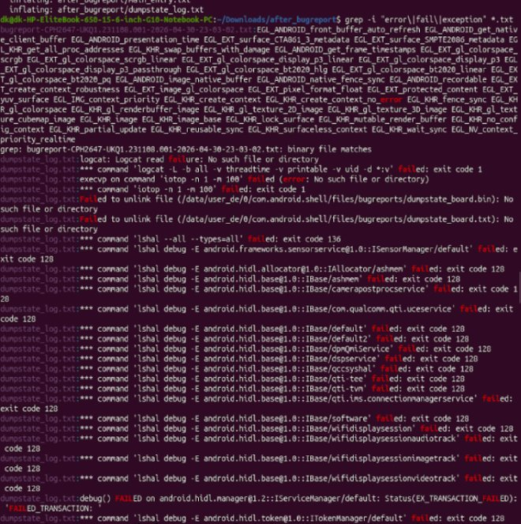
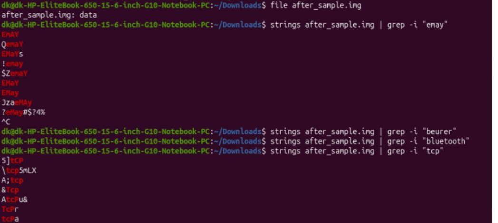
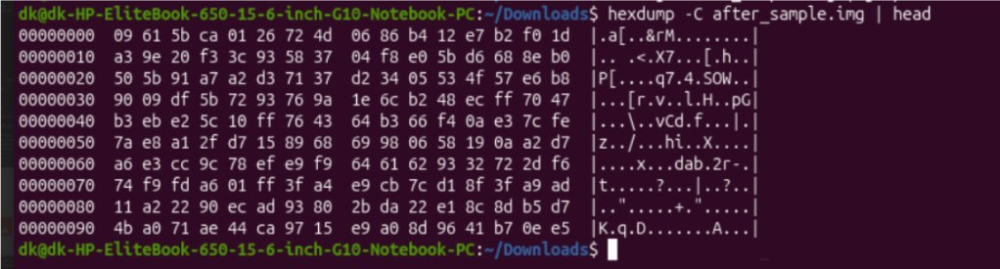

# Network-Level Packet Injection & Forensic Log Analysis

> **Module D + Module E** — BLE Security Analysis of Medical IoT Devices  
> Device under test: OnePlus 13R (Android 15, rooted) · IP: `10.154.12.181`  
> Attacker machine: Linux PC (dk@dk-HP-EliteBook-650) · Same WiFi subnet: `10.154.x.x`

---

## Overview

This module tests whether anomalous network-level activity directed at the Android device — while it is actively connected to BLE medical devices (EMAY EMO-80 and Beurer ELITE950) — generates detectable forensic artifacts in Android system logs.

The attack is **TCP/IP-based, not BLE**. It simulates a scenario where a BLE health gateway device is simultaneously targeted by a network-layer attacker, and asks: *does Android leave a forensic trail?*

---

## Experiment Setup

| Parameter | Value |
|---|---|
| Target device | OnePlus 13R, Android 15, rooted |
| Target IP | `10.154.12.181` |
| Attacker machine | Linux PC — `dk@dk-HP-EliteBook-650` |
| Attack tool | Python 3 + Scapy |
| Target port | `4444` (TCP) |
| Packets sent | 20 crafted TCP packets |
| Interval | ~500 ms between packets |
| BLE state during attack | Connected to EMAY EMO-80 via nRF Connect |

---

## Attack Script

**File:** `send_packet_after.py`

```python
from scapy.all import *

target_ip = "10.154.0.1"
target_port = 4444

for i in range(20):
    pkt = IP(dst=target_ip) / TCP(dport=target_port) / Raw(load="INJECT_TEST_PAYLOAD")
    send(pkt, verbose=False)

print("Sent 20 packets.")
```

**Run as:**
```bash
sudo -E /home/dk/.pyenv/versions/3.11.8/bin/python send_packet_after.py
```

> ⚠️ Scapy prints `SyntaxWarning: 'iface' has no effect on L3 I/O send()` — this is a library warning only. Packets are transmitted successfully as confirmed by tcpdump.

---

## Fig 32 — Scapy Execution: Sent 20 Packets



*`sudo python3 send_packet_after.py` executed twice. Both runs confirm "Sent 20 packets." Scapy iface warning visible — not an error.*

---

## Capture Confirmation (tcpdump)

On the attacker machine, run simultaneously:

```bash
sudo tcpdump -i any tcp port 4444
```

---

## Fig 33 — tcpdump Confirming 20 Packets to Port 4444



*tcpdump confirms 20 outgoing TCP packets from `10.154.12.181:12345` to `10.154.0.1:4444` at ~500 ms intervals. Flags [P.], seq 0:39, length 39 consistent across all 20 packets.*

---

## Forensic Log Collection

### Commands used

```bash
# BEFORE — clear and capture baseline
adb logcat -c
adb logcat > before_log.txt

# Run attack
sudo python3 send_packet_after.py

# AFTER — capture post-injection log
adb logcat > after_log.txt

# Grep for forensic artifacts
grep -i "error\|fail\|exception" after_log.txt
grep -i "tcp\|ip\|socket" after_log.txt
grep -i "connect\|disconnect\|network" after_log.txt
```

---

## Fig 34 — Logcat Analysis: Invalid UID Forensic Marker



*after_log.txt (16K, Apr 30 20:41). Three grep commands run sequentially. Key finding: `BatteryStatsService: Invalid uid for waking network packet: -1` appears 3 times at timestamps 20:41:48–20:41:49 — absent in before_log.txt.*

---

### Key Forensic Finding — `Invalid uid: -1`

> In Android's traffic accounting model, every network packet is attributed to an installed app UID.  
> **UID = -1 means the kernel received a packet it could not attribute to any app** — the forensic signature of externally injected traffic.

| Log Entry | Before | After | Significance |
|---|---|---|---|
| `BatteryStatsService: Invalid uid for waking network packet: -1` | 0 times | 3 times | **Primary forensic marker** |
| `ICMPV6_REQUEST wake up count 161/162` | No | Yes | Network layer triggering WiFi power events |
| `OplusNetlinkSocket: handleNetlinkRecvKernelMessage` | No | Yes | Kernel network subsystem receiving messages |
| `OplusObrain: nativeGetTrafficTypeInfoForNetworkType` | No | Yes | OEM traffic classifier processing new traffic |
| `EX_TRANSACTION_FAILED` | Sometimes | Yes | Android binder IPC stress elevated during attack |

---

## Bugreport Analysis

```bash
adb bugreport after_attack.zip
unzip after_attack.zip -d after_bugreport
cd after_bugreport
grep -i "error\|fail\|exception" *.txt
```

---

## Fig 35 — Bugreport grep Analysis



*`grep -i "error|fail|exception" *.txt` on extracted bugreport. Entries: EX_TRANSACTION_FAILED, multiple `lshal debug` commands failing with exit code 128, `Failed to unlink file`, `logcat: Logcat read Failure`. System-level artifacts captured during injection window.*

---

## Disk Image Forensics

```bash
# Acquire partial disk image (rooted device required)
adb exec-out "su -c 'dd if=/dev/block/sda15 bs=4096 count=1000000'" > after_sample.img

# Verify file type
file after_sample.img

# String analysis
strings after_sample.img | grep -i "emay"
strings after_sample.img | grep -i "beurer"
strings after_sample.img | grep -i "bluetooth"
strings after_sample.img | grep -i "tcp"

# Check encryption entropy
hexdump -C after_sample.img | head
```

---

## Fig 36 — Disk Image String Analysis: EMAY and TCP Artifacts



*`file after_sample.img` → "data". `strings | grep -i "emay"` → EMAY, QemaY, EMaYs, !emay, $ZemaY, EMaY, EMay, JzaeMAy fragments found. `strings | grep -i "beurer"` and `"bluetooth"` → no hits. `strings | grep -i "tcp"` → 5]tcP, \tcp5mLX, A;tcp, &Tcp, TcPr, tcPa found.*

| Search | Result | Interpretation |
|---|---|---|
| `emay` | ✅ Multiple fragments | Residual EMAY device interaction in storage |
| `beurer` | ❌ None | Different session/image |
| `bluetooth` | ❌ None | Encrypted or different partition |
| `tcp` | ✅ Multiple fragments | TCP stack artifacts from network activity |

---

## Fig 37 — Hexdump Confirming Full-Disk Encryption



*`hexdump -C after_sample.img | head` shows high-entropy binary data throughout — no readable ASCII patterns. Confirms Android Full-Disk Encryption (FDE) is active on the userdata partition. Direct filesystem mounting and forensic parsing not feasible without the decryption key.*

---

## OSI Layer Classification

| OSI Layer | Layer Name | Involved? | Notes |
|---|---|---|---|
| 7 | Application | No | No app-level payload interpretation |
| 4 | Transport (TCP) | ✅ Yes | Packets targeted port 4444 via TCP |
| 3 | Network (IP) | ✅ Yes | IP packets routed to Android device IP |
| 2 | Data Link (WiFi) | ✅ Yes | Packets traversed WiFi network |
| N/A | BLE | No | This attack did not touch the BLE stack |

---

## Summary of Findings

| Finding | Evidence | Forensic Value |
|---|---|---|
| TCP injection confirmed | tcpdump: 20 packets at port 4444 | Attack execution verified |
| Android detected injected traffic | `Invalid uid: -1` in logcat ×3 | **Primary forensic artifact** |
| System stress captured | FAILED_TRANSACTION in bugreport | Preserved in bugreport archive |
| EMAY device residue in storage | `emay` fragments in disk image | Survives session termination |
| TCP stack artifacts in storage | `tcp` fragments in disk image | Network activity leaves storage traces |
| Userdata partition encrypted | High-entropy hexdump | Android FDE confirmed — limits deep recovery |

---

## Related Links

- **Main repo:** https://github.com/DEVIKA-KISH/BLE_nrf-dongle_sniffer
- **Google Drive (logs + captures):** https://drive.google.com/drive/folders/16iMSaqkTZw-hQD46mbybE7G1SQhfMHml?usp=sharing

---

## References

- Dzamesi, L., & Elsayed, N. (2025). A review on the security vulnerabilities of the IoMT against malware attacks and DDoS. arXiv:2501.07703.
- Android HCI Snoop Log: https://source.android.com/docs/core/connect/bluetooth/hci_requirements
- Scapy documentation: https://scapy.readthedocs.io
